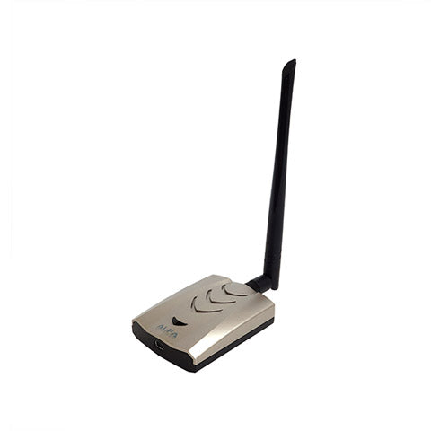

# CURSED-RemoteID
CU Receiver System for Enforcing Drones via Remote ID (CURSED)

The module `raspi-remoteid-receiver` is intended to be run on a Raspberry Pi.
The folder `lambda_src` contains code for AWS Lambda functions.
The folder `website_src` contains code for the website [https://cursedindustries.com](https://cursedindustries.com).

# Installation on Raspberry Pi

## Create virtual environment
Change to home directory, or whatever directory is desired.
```shell
cd
```
Install python3 virtual environment, you can skip this step if it is already installed.
```shell
sudo apt install python3-venv
```
Create a virtual environment
```shell
python3 -m venv remoteid-venv
```
Activate the virtual environment
```shell
source remoteid-venv/bin/activate
```

## Clone repository
Clone the repository.
```shell
git clone https://github.com/Nic0M/CURSED-RemoteID.git
```
Move into the repository and install the requirements with `pip`.
Make sure you have activated the virtual environment before running `pip`.
```shell
cd CURSED-RemoteID
pip install --upgrade pip
pip install -r requirements.txt
```

## Install utilities
Install the command-line version of Wireshark `tshark`.
```shell
sudo apt install tshark
```
Now copy the Open Drone ID .lua script from the git repository to the Wireshark plugins folder.
```shell
cp ~/CURSED-RemoteID/opendroneid-dissector.lua ~/.local/lib/wireshark/plugins/
```
Install `iw` if not already installed with your Linux distribution.
```shell
sudo apt install iw
```
Install aircrack-ng, we specifically need `airmon-ng` from it.
```shell
sudo apt install aircrack-ng
```

## Add AWS Credentials
Skip this step if saving files locally.

Create an S3 bucket.
Create an IAM user group and assign it a policy to only allow it to write to that bucket.
Create a user in that group and generate an AWS access key.
Draw the rest of the owl.

Create the directory which `boto3` will search for AWS credentials in
```shell
mkdir -p ~/.aws && cd ~/.aws
```
Create the credentials file and config file and give read and write access only to the file owner:
```shell
touch credentials && touch config
chmod 600 credentials config
```
With your favorite text editor, add your AWS secret access key.
> credentials
> ```editorconfig
> [default]
> aws_access_key_id = <key id goes here>
> aws_secret_access_key = <secret access key goes here>
> ```
Make sure the region matches the region of the S3 bucket you created.
> config
> ```editorconfig
> [default]
> region = us-east-2
> ```

### Lambda function permissions
Create a new policy. In the JSON editor, paste these permissions.
Change `<your-bucket-name>` to the name of your bucket.
```json
{
    "Version": "2012-10-17",
    "Statement": [
        {
            "Sid": "AllowS3Access",
            "Effect": "Allow",
            "Action": [
                "s3:GetObject",
                "s3:DeleteObject"
            ],
            "Resource": [
                "arn:aws:s3:::<your-bucket-name>/*"
            ]
        }
    ]
}
```
Create a role for an AWS Service, then choose Lambda.
Add the policy you just created to the role.

Create a Python Lambda function and for the execution role, choose the role you just created.
Now select upload from a `.zip` file.
Choose the `lambda_insert_into_database_deployment_package.zip` located in the directory
`~/CURSED-RemoteID/lambda_src/lambda_insert_into_database/`.
Copy and paste the `lambda_function.py` file from that same directory into the lambda function code source.

#### TODO:
Assign a trigger and create RDS database.

## Running tests
```shell
cd ~/CURSED-RemoteID
```
To run all tests:
```shell
python -m raspi_remoteid_receiver.tests
```
To run a specific test suite:
```shell
python -m raspi-remoteid_receiver.tests.TEST_SUITE_NAME_GOES_HERE
```
Available tests:
- `installation_test` tests if utilities are installed
- `aws_test`


## Running the main script

Ensure the USB network card is connected. The AFA AWUS036ACHM shown below has been used successfully with this script.
<h3 align="center"></h3>

```shell
cd ~/CURSED-RemoteID
```
Make sure the virtual environment is activated and you have sudo permissions.
```shell
python -m raspi_remoteid_receiver.core
```
### Verbose Mode
Set the `-v` or `--verbose` flag to show more information to the console.
```shell
python -m raspi_remoteid_receiver.core --verbose
```
### Uploading to AWS
To upload to AWS, include the flag `--upload-to-aws`.
You may also want to include the bucket name with `--bucket-name <bucket name>` (the default is `'cursed-remoteid-data'`).
```shell
python -m raspi_remoteid_receiver.core --upload-to-aws --bucket-name 'cursed-remoteid-data'
```
To run without uploading, remove the `--upload-to-aws` flag or explicitly set `--no-upload-to-aws` flag after the upload flag.
```shell
python -m raspi_remoteid_receiver.core --no-upload-to-aws
```

### Optional Arguments
- `--disable-wifi` disables Wi-Fi scanning
- `--disable-bt` disables Bluetooth scanning
- `--upload-to-aws` enables uploading to an Amazon S3 bucket
- `--bucket-name` specifies an Amazon S3 bucket name (default is `'cursed-remoteid-data'`)
- `-v`, `--verbose` enables verbose console output
- `--debug` enables debug logging
- `--log-file` specifies a log file location (default is `'logs/debug.log'`)

## Running the script on boot
WIP
